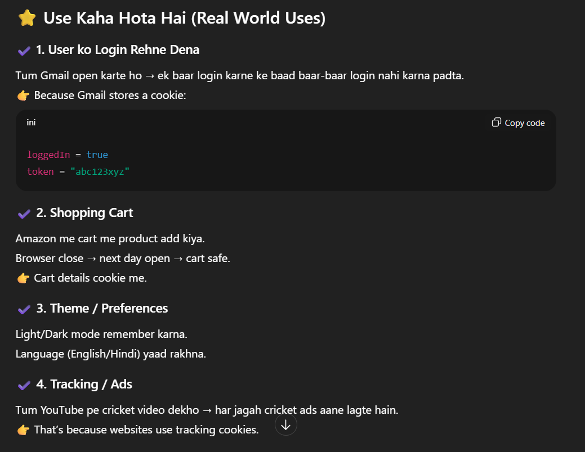

🍪 What Are Cookies?

Cookies = small data (tiny text files) jo browser me save hota hai, jab bhi koi website tumhare system ko kuch yaad rakhna chahti hai.



### Taking cookies using input(*prompt keyword*)
```js
let key=prompt("Enter Key")
let val=prompt("Enter value")
document.cookie=`${key}=${val}`
```

### Improving Input techniques using encodeURIComponent
```js
let key=prompt("Enter Key")
let val=prompt("Enter value")
document.cookie=`${encodeURIComponent(key)}=${encodeURIComponenet(val)}`
console.log(decodeURIComponenet(";;d dj"))
```
